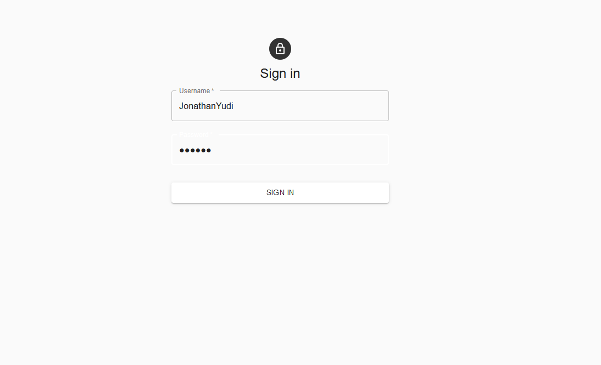
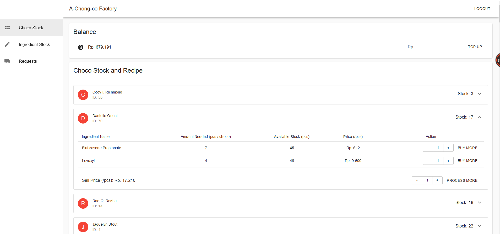
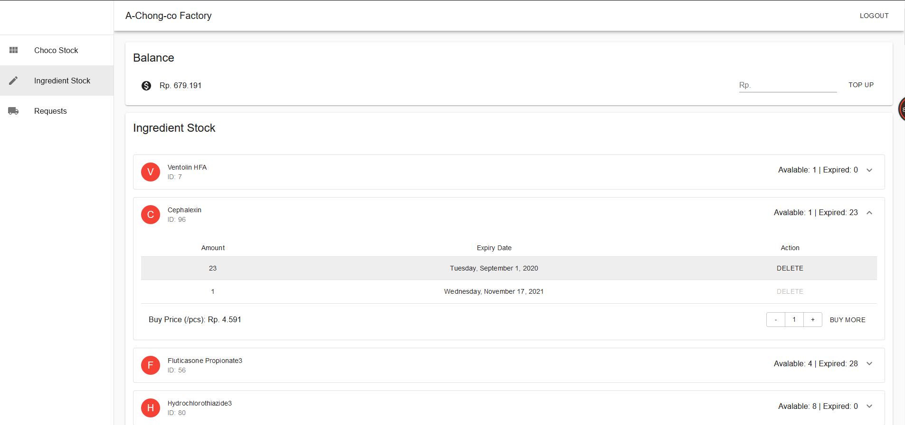
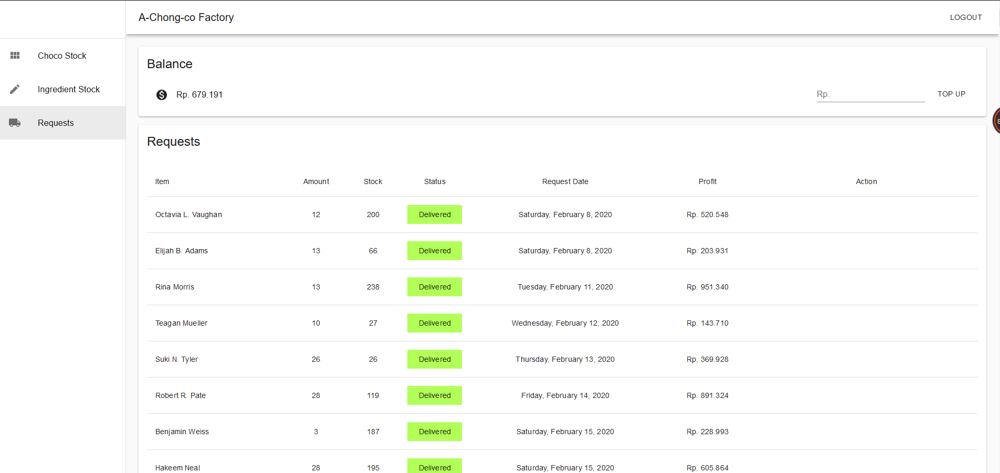

# Choco-Factory-Website

1 of 4 part from Chocolate Factory Website

A chocolate factory website made using React and Material UI

## Prerequisites

1. Node.js

This website is split into 2 part. API / server part and client / static site part. Client will make a request to server.

## Setup and Running

1. Install [Node.js](https://nodejs.org/en/)
1. Install dependencies using `npm install` on each folder (api and client)
1. Start server using `npm start` on each folder (api and client)

## More Details

[API / Server Readme](./api/README.md)

[Client / Static Page Readme](./client/README.md)

## Screenshot

Here is some website screenshots

Login Page

Choco Stock Page

Ingredient Stock Page

Requests Page

## Author

[Jonathan Yudi Gunawan](https://github.com/JonathanGun/) - 13518084

## Acknowledgement

This project is made to fulfill IF3110 Website Development course
