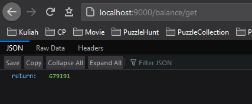
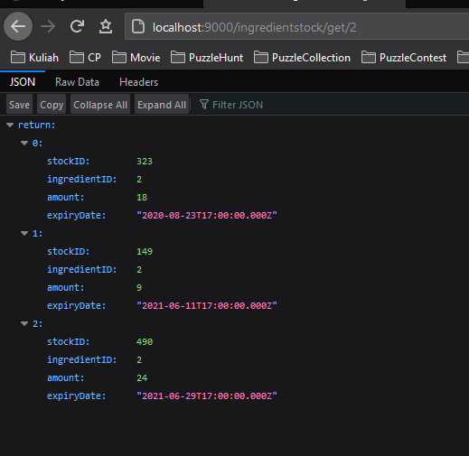
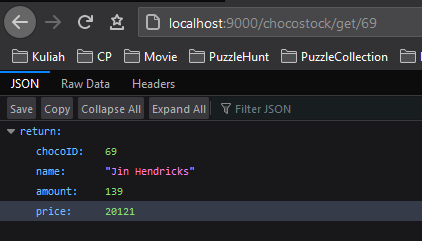
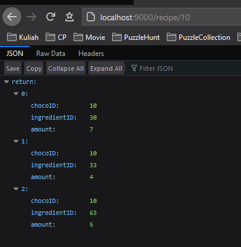
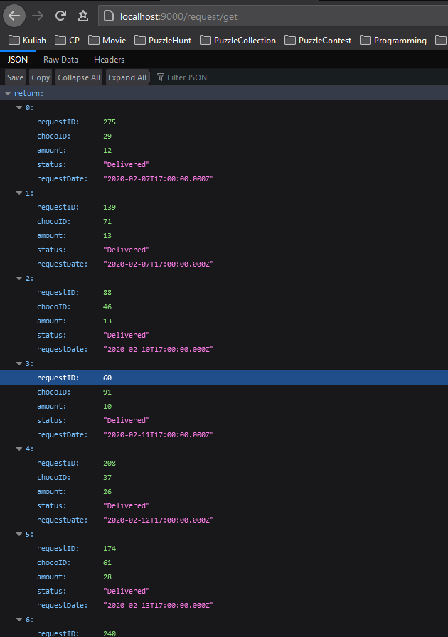
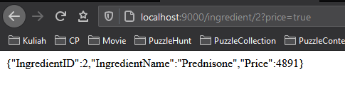
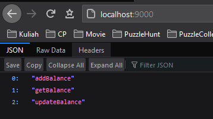

## Node Libraries

1. react
1. express-generator
1. soap
1. easysoap

API server runs on [http://localhost:9000/](http://localhost:9000/)

## Project Structure

```
api
├───public
│   └───stylesheets
│           style.css
│
├───routes
│       balance.js
│       chocofac.js
│       chocostock.js
│       config.js
│       ingredient.js
│       ingredientstock.js
│       recipe.js
│       request.js
│       user.js
│
└───views
        error.jade
        layout.jade
```

## API Endpoints

### Balance



1. GET /balance

> get current balance
> output: `integer`

2. POST /balance/add

```
{
  "amount": 100
}
```

> add x money to balance
> output: `boolean`

3. POST /balance/update

```
{
  "amount": 100
}
```

> update balance to x money
> output: `boolean`

### Ingredient Stock



1. GET /ingredientstock/:id?notexpired=true

> get ingredients stock of supplied id = ingredientID (optional: notexpired)
> output: `array of IngredientStock`

```
IngredientStock: {
  stockID: integer,
  ingredientID: integer,
  amount: integer,
  expiryDate: DateTime
}
```

2. GET /ingredientstock/total/:id

> get sum of ingredientstock of the supplied id
> output: `integer`

2. GET /ingredientstock/total/

> get sum of ingredientstock of all ingredients
> output: `array of {ingredientID: integer, amount: integer}`

3. POST /ingredientstock/add/:ingredientID

```
{
  "amount": 10,
}
```

> add stock of ingredient of the supplied id
> output: `boolean`

4. POST /ingredientstock/update/:stockid

```
{
  "amount": 10,
}
```

> update stock of ingredient of the supplied id
> output: `boolean`

5. POST /ingredientstock/delete/:stockid

> deletes stock of ingredient of supplied id from database (proceed with caution)
> output: `boolean`

### Choco Stock



1. GET /chocostock/:id

> get stock of chocolate with supplied id
> output: `integer`

2. GET /

> get stock of all chocolate
> output: `list of {chocoid: integer, amount: integer}`

### Recipe



1. GET /recipe/:id

> get recipe of a chocolate with supplied id
> output: `{chocoID: integer, ingredientID: integer, amount: integer}`

2. POST /recipe/add

```
{
  "chocoid":101,
  "name":"Ali baba",
  "price":5000,
  "ids":[1,31,59],
  "amounts":[2,5,7]
}
```

> add a recipe of a chocolate with id = chocoid.
> recipe consist of array of ingredient id = ids with each amount = amounts.
> output: `integer` id

### Request



1. GET /request/:id

> get request with supplied id
> output: `Request`

```
Request: {
  requestID: integer,
  chocoID: integer,
  amount: integer,
  status: String, (Pending | Delivered)
  requestDate: DateTime
}
```

2. GET /request

> get all request
> output: `array of Request`

3. GET /request/status/:id

> get status of a request with supplied id
> output: `String` (Pending | Delivered)

4. POST /request/add

```
{
  "chocoid": 3,
  "amount": 123
}
```

> add a new request
> output: `boolean`

5. POST /request/deliver/:id

```
{
  "id": 72
}
```

> deliver a request with supplied id
> output: `boolean`

### Ingredient



1. GET /ingredient/:id?price=true

> get detail of ingredient of supplied id (optional: price)
> output: `Ingredient`

```
Ingredient: {
  "id": integer,
  "name": string,
  "price": integer
}
```

2. GET /ingredient/?price=true

> get detail of all ingredient (optional: price)
> output: `array of Ingredient`

3. POST /ingredient/buy/

```
{
  "money": integer,
  "ingredients":[
    {
      "id": integer,
      "amount": integer,
    },
    ...
    {
    "id": integer,
    "amount": integer,
    }
  ]
}
```

> buy an ingredient with some money
> output: `integer` (Remaining Money | Needed Money)

### General (WIP)



1. GET /

> get all available function
> output: `array of String`

2. GET /help/:methodName

> get the method params by given methodName (not complete)
> output: javascript object {request:object, response:object, params: object}

## Author

[Jonathan Yudi Gunawan](https://github.com/JonathanGun/) - 13518084

## Acknowledgement

This project is made to fulfill IF3110 Website Development course
